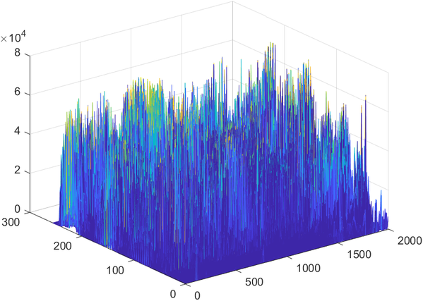

# Color Structure Descriptor - based CBIR System
Implementation of a CBIR (Content-Based Image Retrieval) system based on the Color Structure Descriptor (CSD) of MPEG-7 for the Image and Video Processing subject.


<p align="center"><a href="./README.md">Català</a> / [English]</p>


<p align="center">
  <br />
  Visualization of all CSD descriptors for the 2,000 images in the UKBench dataset
</p>


## Introduction
This repository contains the files and code related to the second version of the CBIR system. The project has been developed by [Joana Justo](https://github.com/joanajusto) and el [Víctor Moreno](https://github.com/victhormoreno), telecommunications students, as part of the Image and Video Processing lab during the spring semester of 2023.

If you want more detailed and technical information about the system, as well as its results and performance, we recommend checking the reports located in the [`/docs/reports/`](/docs/reports) folder of this repository.

The available reports are:

1. prog1 report: [Download here](docs/reports/memoria_prog1_moreno_justo.pdf)
2. prog2 report: [Download here](docs/reports/memoria_prog2_moreno_justo.pdf)

The first version of the system (prog 1) can be found at branch [prog1](../../tree/prog1) from this repository. This one uses the histogram of the grayscale image as a descriptor in the CSD location.

## System Structure

The system structure is organized into several directories. The [`data`](/data/) directory contains the necessary data files, such as the H.mat feature matrix and input/output files. The [`functions`](/functions/) directory contains the functions for descriptor extraction and image distance calculation. On the other hand, the [`scripts`](/scripts/)  directory contains the main code files for executing the system.

```
+---data
|   |   H.mat
|   |   input.txt
|   |   output.txt
|   +---database
+---docs
+---functions
|   +---descriptors
|   +---distances
+---scripts
        cbir_system.m
        evaluation.m
```

The main directory of the system contains the following subdirectories and files:

+ [`H.mat`](/data/H.mat): This file contains the feature matrix of the images stored in the database.

+ [`input.txt`](/data/input.txt): This file contains the input data for the system query.

+ [`output.txt`](/data/output.txt):  This file will contain the system outputs or results.

+ [`descriptors`](/functions/descriptors/): This subdirectory contains the functions related to image descriptor extraction.

+ [`distances`](/functions/distances/): This subdirectory contains the functions for calculating distances between image descriptors.

+ [`cbir_system.m`](/scripts/cbir_system.m) : This is the main file of the system, which contains the code to run the CBIR system.

+ [`evaluation.m`](/scripts/evaluation.m): This file can contain the code to evaluate the results or performance of the system.

## Using the CBIR System
### 0. Clone the repository
To get started, clone the repository using the following command:

``git clone https://github.com/victhormoreno/PIV-Prog-2``

### 1. Add the database
Download the database from the following link: [https://archive.org/details/ukbench](https://archive.org/details/ukbench).  

Once downloaded, extract it and save the image files in the `/data/database` folder.

### 2. Customize the System

#### 2.1. Change the parameters
Modify the parameters according to your preferences. Edit the first section of the file  [`/scripts/cbir_system.m`](scripts/cbir_system.m)  to specify the search options and the descriptors you want to use.

```
update_H = false; % True: update H matrix from data
path = 'C:\Users\victo\Desktop\prog2'; % Path to own project folder
quantification = 256; % Number of levels img hmmd: 128 or 256
bins = 128; Number bins of the descritor
dist_type = 'bachata'; % Options: 'mse' / 'chi' / 'bachata'
N = 10; % Number of candidates per image
```

+ ``update_H``: A Boolean flag that determines whether you want to update the H matrix from the data. If set to true, the H matrix will be updated; if set to false, the H matrix will not be modified.
+ ``path``:  The path to your own project folder. Make sure to specify the correct path in this parameter.
+ ``quantification``: Number of levels img hmmd: 128 or 256
+ ``bins``: The number of bins for the descriptor. You can choose between 1 and quantification, depending on your preferences and needs.
+ ``dist_type``: The type of distance you want to use for the search. You have the following options: 'mse' (Mean Squared Error), 'chi' (Chi-Squared), 'bachata' (Bhattacharyya). Select the distance type that best suits your system.
+ ``N``:  The number of candidates per image that you want to obtain in the search. You can adjust this value based on the desired number of results.


#### 2.2. Modify input.txt
Modify the file [`\data\input.txt`](data/input.txt) to perform the image search. This file contains the names of the images to be searched, separated by line breaks. An example file is provided in the repository:

```
ukbench01701.jpg
ukbench00926.jpg
ukbench01883.jpg

...

ukbench00801.jpg
```

### 3. Execute the System

Once the previous steps have been completed, the main program can be executed. To do this, access `/scripts/cbir_system.m`  and press the  `run` button in matlab.

### 4. Evaluation of Performance
Analyze the obtained results and evaluate the performance of the CBIR system based on the established criteria. Make the necessary adjustments to the parameters or descriptors to achieve the desired results. The script `evaluation.m`  can be used to calculate the F-score and the Recall and Precision curves for a given `output.txt` file.

This is a basic structure for using the CBIR system. If needed, adapt the instructions according to your specific needs and requirements.


